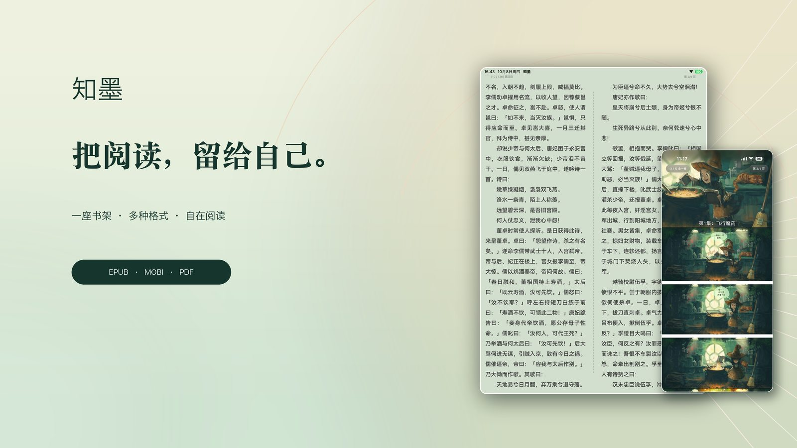

# 知墨 · Zhimor

**让阅读，回归纯粹。** · *A quieter place to read.*

知墨是一款面向 iPhone、iPad 和 Mac 的电子书阅读与书库管理应用。
从整理自己的藏书，到沉浸在每一页文字中，希望让阅读成为一件自在、专注的事。

**[访问知墨官网](https://zzhdong.github.io/Zhimor/)** · **App Store：即将上线**（正式上架后开放下载）

  

### 为阅读而设计

- **一座书架，多种格式** — 导入并整理电子书、文本、PDF 和漫画，按自己的方式管理阅读内容。
- **舒适的阅读体验** — 调整字体、主题、布局和翻页方式，找到适合自己的阅读节奏。
- **留下阅读足迹** — 通过阅读进度和统计，回顾读过的书与投入的时间。
- **本地优先，云端可选** — 本地阅读无需注册知墨账号；有需要时可使用 iCloud 同步或连接支持的网络存储服务。

### 隐私与选择

知墨不投放广告，也不进行跨应用或跨网站追踪。
本地阅读数据由你管理；使用 iCloud 或第三方网络服务属于可选操作，具体数据处理说明请参阅 **[隐私政策](https://zzhdong.github.io/Zhimor/privacy/)**。

### 支持与反馈

如遇到书籍导入、阅读排版、同步或云盘连接方面的问题，请发送邮件至
**[zzhdong@gmail.com](mailto:zzhdong@gmail.com)**，也可访问 **[技术支持](https://zzhdong.github.io/Zhimor/support/)**。
建议附上设备型号、系统版本和问题复现步骤；请勿发送密码、访问令牌或私人书籍内容。

---

## English

**Zhimor — A quieter place to read.**

Zhimor is an ebook reader and personal library app for iPhone, iPad and Mac.
It gives your books a considered space and keeps the experience focused on reading.

**[Official website](https://zzhdong.github.io/Zhimor/)** · **App Store: Coming soon** (download available after release)

### Made for your reading life

- **One library, many formats** — Import and organise ebooks, text documents, PDFs and comics.
- **A reading space of your own** — Personalise typography, themes, layouts and page-turning.
- **Your reading journey** — Follow your progress and revisit your reading statistics.
- **Local first, cloud optional** — Read locally without a Zhimor account; choose iCloud syncing or supported network storage when you need it.

### Privacy and choice

Zhimor has no ads and does not track you across apps or websites.
Local reading works without a Zhimor account. iCloud and third-party network services are optional.
Read the **[Privacy Policy](https://zzhdong.github.io/Zhimor/en/privacy/)** for details on how data is stored and managed.

### Support

For help with imports, reading layouts, sync or cloud connections, email
**[zzhdong@gmail.com](mailto:zzhdong@gmail.com)** or visit **[Support](https://zzhdong.github.io/Zhimor/en/support/)**.
Include your device, OS version and steps to reproduce the issue where possible.
Please do not send passwords, access tokens or private book contents.

---

© 2026 Zhimor
